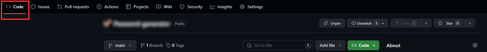
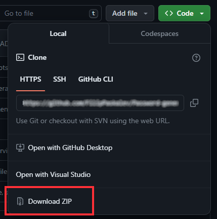
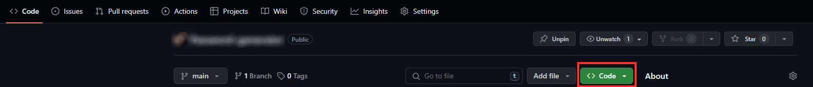
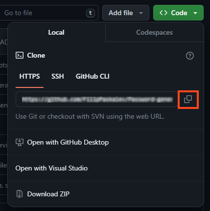

# Project-01-Event-Search-Dashboard

## Table of Contents 

<!-- TODO TOC  -->

## Project Description

The idea of our project was to build a web application that
met the requirements of our project, would be functional and
that we could build and keep as accessible as possible. We
decided to create an event-search dashboard. The web
application would host a number of events from different
hobbies and interests across either across the globe or nation
(depended on which third-party API) and could would enable
users to purchase tickets for said event online.

<!-- Our application is an event search dashboard which showcases events in the users chosen city, these events fall under a number of different categories; dining, partying, music events, networking etc and allows users to buy tickets to said event - it contains ticket prices. locations and the date of the event.  -->

## Motivation

Our motivation for creating this was
to build a hub that sourced events,
experiences and enjoyment for people
to do easily and with minimal
difficulty. The convenience that came
with being able to find and research
for your city and find events in
different categories is something we
felt would appeal to just about any
adult in today’s world.

## User story

```
AS A developer

I WANT to be able to create an event search
dashboard where I can LOCATE, my city, FIND
an event AND BOOK tickets/reservations etc.

So THAT I can schedule something to do over the weekend.
```

## The process

### Research

Researching was integral part of the building process, we had to
figure out which third-party API’s we wanted to use, what
software we planned to use, it was quite literally the foundation
of our entire web application.

A large part of our research involved setting aims and objectives which simultaneously went
with the rest of the work that we were doing. Our end goal was to quite literally build a
web application that allowed users to search for different kind of events by city so we
spent a lot of the beginning of our project searching for soltuions, API’s and bootstrap
code that allowed us to execute this.

### Wireframing

This led us from the research stage to the visual and implementation
stage, with a wireframe now rendered and complete, we could begin the
building and web development part of our event search dashboard. It
defined the elements of the site we wanted the web application to have
without delving too deep into the look of it, it was a helpful and
important framework.

Before starting development on our application, we started the visualisation of the structural elements of the website before the actual programming to get a better idea of the architecture of our site. We usedFigma to construct the wireframe and check the concept’s responsiveness across different devices and used this as our baseline for developing.

### Construction & web development

This is the stage we knew we would be spending the longest, bringing
the research and the framework that the wireframe gave us to begin
building the HTML, CSS and JavaScript that our web application would
need.

### CSS + UI DESIGN

This process was very much a continual and gradual build up, while
it’s left as our final step, it commenced early as we needed visualr
refrences as we built the frame (HTML etc.) to know what our users
would be looking at when they came to interact with our final web
application.


### Breakdown of the tasks


### Mock up


### How to use

### User Interface

### Additional Features

### Technical Implementation


## Installation instructions

### Option 1 - Download

Download the project from GitHub [repository](https://github.com/jaiminiprajapati/Project-01-Event-Search-Dashboard) on your local machine.

1. Open GitHub repository. [(link to repository)](https://github.com/jaiminiprajapati/Project-01-Event-Search-Dashboard)

2. Select ```Code``` from top navigation section. (reference on the image below) 👇

    

3. Select ```<> Code``` dropdown button from sub section. (reference on the image below) 👇

    

4. Select ```Download ZIP``` from dropdown menu to download project in .zip format. (reference on the image below) 👇

    

5.  Unzip the project. 

    > [!TIP]
    > You can use 7-Zip if you don't have file archiver. 
    >**7-Zip** is **free software** with **open source**. The most of the code is under the **GNU LGPL** license. Some parts of the code are under the BSD 3-clause License. Also there is unRAR license restriction for some parts of the code. Read [7-Zip License](https://www.7-zip.org/license.txt) information. 
    > Download the application from [official website](https://www.7-zip.org/).

6.  Open project with [VS Code](https://code.visualstudio.com/) or other IDE.

### Option 2 - Clone project

1. On GitHub.com, navigate to the main page of the repository. [(link to repository)](https://github.com/jaiminiprajapati/Project-01-Event-Search-Dashboard).

2. Above the list of files, click  Code. (reference on the image below) 👇

    

3. Copy the URL for the repository.
- To clone the repository using HTTPS, under "HTTPS", click <svg version="1.1" fill="#0F66B8" width="16" height="16" viewBox="0 0 16 16" aria-label="Copy to clipboard" role="img"><path d="M3.626 3.533a.249.249 0 0 0-.126.217v9.5c0 .138.112.25.25.25h8.5a.25.25 0 0 0 .25-.25v-9.5a.249.249 0 0 0-.126-.217.75.75 0 0 1 .752-1.298c.541.313.874.89.874 1.515v9.5A1.75 1.75 0 0 1 12.25 15h-8.5A1.75 1.75 0 0 1 2 13.25v-9.5c0-.625.333-1.202.874-1.515a.75.75 0 0 1 .752 1.298ZM5.75 1h4.5a.75.75 0 0 1 .75.75v3a.75.75 0 0 1-.75.75h-4.5A.75.75 0 0 1 5 4.75v-3A.75.75 0 0 1 5.75 1Zm.75 3h3V2.5h-3Z"></path></svg>
- To clone the repository using an SSH key, including a certificate issued by your organization's SSH certificate authority, click SSH, then click <svg version="1.1" fill="#0F66B8" width="16" height="16" viewBox="0 0 16 16" aria-label="Copy to clipboard" role="img"><path d="M3.626 3.533a.249.249 0 0 0-.126.217v9.5c0 .138.112.25.25.25h8.5a.25.25 0 0 0 .25-.25v-9.5a.249.249 0 0 0-.126-.217.75.75 0 0 1 .752-1.298c.541.313.874.89.874 1.515v9.5A1.75 1.75 0 0 1 12.25 15h-8.5A1.75 1.75 0 0 1 2 13.25v-9.5c0-.625.333-1.202.874-1.515a.75.75 0 0 1 .752 1.298ZM5.75 1h4.5a.75.75 0 0 1 .75.75v3a.75.75 0 0 1-.75.75h-4.5A.75.75 0 0 1 5 4.75v-3A.75.75 0 0 1 5.75 1Zm.75 3h3V2.5h-3Z"></path></svg>
- To clone a repository using GitHub CLI, click GitHub CLI, then click <svg version="1.1" fill="#0F66B8" width="16" height="16" viewBox="0 0 16 16" aria-label="Copy to clipboard" role="img"><path d="M0 6.75C0 5.784.784 5 1.75 5h1.5a.75.75 0 0 1 0 1.5h-1.5a.25.25 0 0 0-.25.25v7.5c0 .138.112.25.25.25h7.5a.25.25 0 0 0 .25-.25v-1.5a.75.75 0 0 1 1.5 0v1.5A1.75 1.75 0 0 1 9.25 16h-7.5A1.75 1.75 0 0 1 0 14.25Z"></path><path d="M5 1.75C5 .784 5.784 0 6.75 0h7.5C15.216 0 16 .784 16 1.75v7.5A1.75 1.75 0 0 1 14.25 11h-7.5A1.75 1.75 0 0 1 5 9.25Zm1.75-.25a.25.25 0 0 0-.25.25v7.5c0 .138.112.25.25.25h7.5a.25.25 0 0 0 .25-.25v-7.5a.25.25 0 0 0-.25-.25Z"></path></svg> (reference on the image below) 👇

    

1. Open Git Bash.

2. Change the current working directory to the location where you want the cloned directory.

3. Type ```git clone```, and then paste the URL you copied earlier.

    ```
    git clone https://github.com/jaiminiprajapati/Project-01-Event-Search-Dashboard.git
    ```

4. Press Enter to create your local clone.

    ```
    $ git clone https://github.com/jaiminiprajapati/Project-01-Event-Search-Dashboard.git
    > Cloning into `Spoon-Knife`...
    > remote: Counting objects: 10, done.
    > remote: Compressing objects: 100% (8/8), done.
    > remove: Total 10 (delta 1), reused 10 (delta 1)
    > Unpacking objects: 100% (10/10), done.
    ```

## Tools and extensions

[Visual Studio Code](https://code.visualstudio.com/) is a lightweight but powerful source code editor which runs on your desktop and is available for Windows, macOS and Linux. It comes with built-in support for JavaScript, TypeScript and Node.js and has a rich ecosystem of extensions for other languages and runtime (such as C++, C#, Java, Python, PHP, Go, .NET).

### VS Code Counter

[VS Code extension](https://marketplace.visualstudio.com/items?itemName=uctakeoff.vscode-counter) counts blank lines, comment lines, and physical lines of source code in many programming languages. This extension uses other language extensions to determine the line of code. Therefore, you may need to install the language extension to support a new language. Conversely, as the number of language extensions increases, the range of support for this feature also increases.

## Project structure

```
root/                         //
  |----assets                 // 
        |----readme           // 
  |----images                 // 
        |----default          //
        |----events           //
        |----music festivals  //
  |----js                     //
        |----api              //
        |----creators         //
        |----renders          //
        |----res              //
  |----.gitignore             //
  |----index.html             //
  |----LICENSE                //
  |----README.md              //
  |----script.js              //
  |----style.css              //
  |----uiTemplate.html        //
```

## API Reference

### Get all items

```http
  GET /api/items
```

| Parameter              | Type     | Description                |
| :--------------------- | :------- | :------------------------- |
| `OPENCAGEDATA_API_KEY` | `string` | **Required API key** |
| `SEATGEEK_API_KEY`     | `string` | **Required API key** |
| `DATATHISTLE_API_KEY`  | `string` | **Required API key** |


## Statistics

### Files
| filename | language | code | comment | blank | total |
| :--- | :--- | ---: | ---: | ---: | ---: |
| [README.md](/README.md) | Markdown | 78 | 0 | 55 | 133 |
| [index.html](/index.html) | HTML | 342 | 24 | 27 | 393 |
| [js/api/datathistle.js](/js/api/datathistle.js) | JavaScript | 0 | 13 | 3 | 16 |
| [js/api/seatgeek.js](/js/api/seatgeek.js) | JavaScript | 71 | 1 | 11 | 83 |
| [js/api/userLocation.js](/js/api/userLocation.js) | JavaScript | 19 | 0 | 2 | 21 |
| [js/autocomleate.js](/js/autocomleate.js) | JavaScript | 0 | 29 | 6 | 35 |
| [js/creators/searchBycategoryDropdown.js](/js/creators/searchBycategoryDropdown.js) | JavaScript | 8 | 0 | 1 | 9 |
| [js/creators/upcomingEventCard.js](/js/creators/upcomingEventCard.js) | JavaScript | 41 | 2 | 4 | 47 |
| [js/renders/categorySearchDropdown.js](/js/renders/categorySearchDropdown.js) | JavaScript | 7 | 0 | 1 | 8 |
| [js/renders/filteredEventsbyCategory.js](/js/renders/filteredEventsbyCategory.js) | JavaScript | 14 | 1 | 5 | 20 |
| [js/renders/upcomingEventsSection.js](/js/renders/upcomingEventsSection.js) | JavaScript | 5 | 0 | 1 | 6 |
| [js/res/localeStorage.js](/js/res/localeStorage.js) | JavaScript | 9 | 0 | 3 | 12 |
| [js/res/utils.js](/js/res/utils.js) | JavaScript | 29 | 0 | 7 | 36 |
| [script.js](/script.js) | JavaScript | 37 | 1 | 8 | 46 |
| [style.css](/style.css) | CSS | 259 | 0 | 44 | 303 |
| [uiTemplate.html](/uiTemplate.html) | HTML | 443 | 24 | 30 | 497 |

[Summary](results.md) / Details / [Diff Summary](diff.md) / [Diff Details](diff-details.md)

### Languages
| language | files | code | comment | blank | total |
| :--- | ---: | ---: | ---: | ---: | ---: |
| HTML | 2 | 785 | 48 | 57 | 890 |
| CSS | 1 | 259 | 0 | 44 | 303 |
| JavaScript | 12 | 240 | 47 | 52 | 339 |
| Markdown | 1 | 78 | 0 | 55 | 133 |

### Directories
| path | files | code | comment | blank | total |
| :--- | ---: | ---: | ---: | ---: | ---: |
| . | 16 | 1,362 | 95 | 208 | 1,665 |
| . (Files) | 5 | 1,159 | 49 | 164 | 1,372 |
| js | 11 | 203 | 46 | 44 | 293 |
| js (Files) | 1 | 0 | 29 | 6 | 35 |
| js\\api | 3 | 90 | 14 | 16 | 120 |
| js\\creators | 2 | 49 | 2 | 5 | 56 |
| js\\renders | 3 | 26 | 1 | 7 | 34 |
| js\\res | 2 | 38 | 0 | 10 | 48 |
